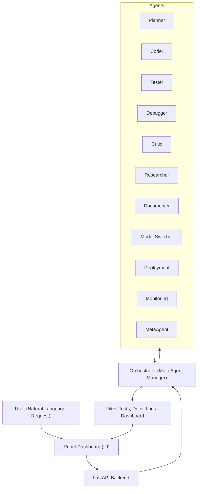
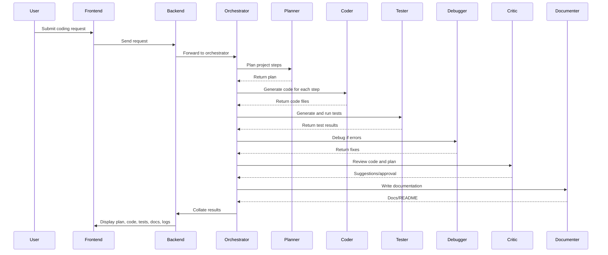
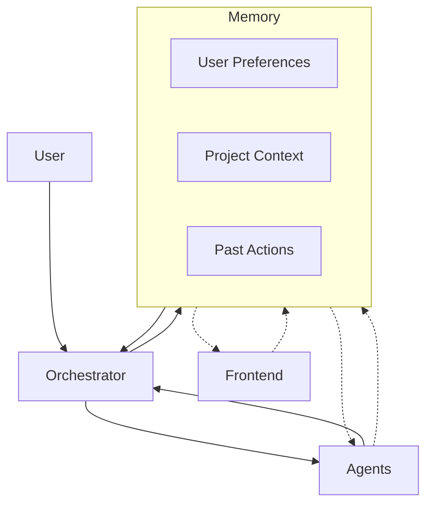
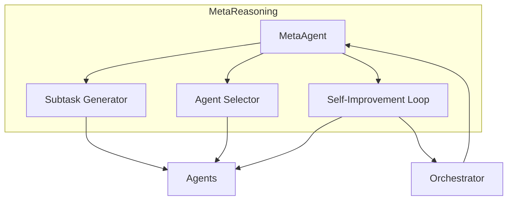
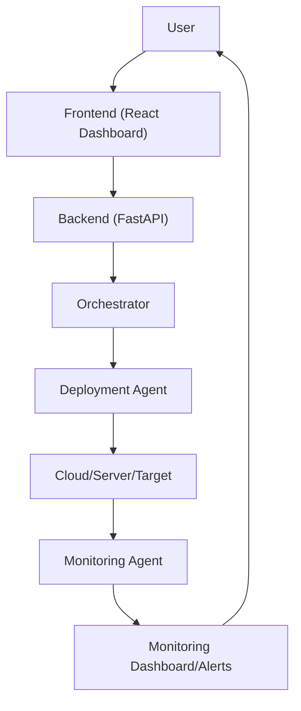

# 🧑‍💻 Multi-Agent Coding System

Welcome! This is a world-class, autonomous, multi-modal, multi-agent coding system inspired by Devin, Cursor, Copilot, Replit, Manus, and the open-source community. It is designed for both technical and non-technical users to research, plan, code, test, debug, document, deploy, and monitor software projects with ease.

---

## 🌐 Architecture Overview



---

## 🤖 Agent Table

| Agent Name       | Role/Responsibility                                                                 | Prompt Style/Notes                |
|------------------|-------------------------------------------------------------------------------------|-----------------------------------|
| **Planner**      | Breaks down user requests into actionable steps and a project plan                  | Research-driven, stepwise         |
| **Coder**        | Writes code for each step/file                                                      | Modular, best-practices           |
| **Tester**       | Generates and runs tests for the code                                               | Unittest, pytest, etc.            |
| **Debugger**     | Diagnoses and fixes errors in code or tests                                         | Error analysis, auto-fix          |
| **Critic**       | Reviews code and plans for quality, security, and best practices                    | Constructive, research-backed     |
| **Researcher**   | Looks up best practices, libraries, and open-source solutions                       | Web search, summarization         |
| **Documenter**   | Writes documentation, docstrings, and README content                                | Clear, beginner-friendly          |
| **Modal Switcher**| Switches between code, text, diagrams, or other modalities as needed               | Multi-modal, context-aware        |
| **Deployment**   | Handles deployment scripts, CI/CD, and rollback                                     | Safe, robust, rollback-ready      |
| **Monitoring**   | Adds monitoring, logging, and health checks                                         | Observability, alerting           |
| **MetaAgent**    | Oversees and coordinates all agents, handles recursive subtasks and meta-reasoning  | Hierarchical, self-improving      |

---

## 🔄 Agent Workflow



---

## 🧠 Persistent Memory & Context

The system maintains persistent memory for user preferences, project context, and past actions, enabling context-aware, personalized, and stateful agentic workflows.



---

## 🧬 Meta-Reasoning & Recursive Subtasks

The MetaAgent oversees all agents, spawns recursive/hierarchical subtasks, selects the best agent for each job, and continuously improves the workflow through feedback loops.



---

## 🚢 Deployment & Monitoring Workflow

Automated deployment and monitoring are handled by specialized agents, ensuring safe rollouts, observability, and rapid rollback if needed.



---

## 🌟 Features
- **Natural Language Coding:** Accepts plain English requests, no coding required.
- **Multi-Agent Orchestration:** Specialized agents for planning, coding, testing, debugging, documentation, deployment, monitoring, and meta-reasoning.
- **Research-Driven:** Agents research best practices and open-source solutions before coding.
- **Persistent Memory:** Remembers user preferences, project context, and past actions.
- **Recursive/Hierarchical Subtasks:** Agents can spawn subtasks and coordinate complex workflows.
- **Meta-Reasoning:** MetaAgent oversees, optimizes, and improves agent collaboration.
- **User-in-the-Loop:** Checkpoints and approvals for critical steps.
- **Deployment & Rollback:** Safe, automated deployment with rollback support.
- **Monitoring & Observability:** Built-in health checks, logging, and alerting.
- **Beautiful React Dashboard:** Modern, beginner-friendly UI with stepper, file explorer, code viewer, test results, agent logs, and LLM output.
- **Comprehensive Documentation:** Auto-generated docs, diagrams, and usage guides.
- **Open-Source & Extensible:** Modular, easy to extend with new agents or workflows.

---

## 🧑‍💻 Example Prompts
- Build a Python function to add two numbers and write a test for it.
- Create a Flask API for a todo app with authentication.
- Generate a trading bot for MetaTrader 5 that scalps EURUSD.
- Write a script to scrape news headlines and save to CSV.
- Write a Python script to download all images from a given URL.
- Create a Jupyter notebook that loads a CSV, computes summary statistics, and plots a histogram.
- Generate a React component for a login form with email and password fields, and basic validation.
- Build a FastAPI backend for a book library with CRUD endpoints.
- Write a Bash script to backup a directory to a remote server using rsync.
- Create a Python script to send daily email reminders using SMTP.
- Build a Django model and serializer for a blog post with tags.
- Write a Node.js script to monitor a folder and log new files.
- Generate a C++ class for a simple bank account with deposit/withdraw methods.
- Create a SQL query to find the top 5 customers by total purchase amount.

---

## 🚀 Dashboard Screenshot


---

## 📦 Repository
- [GitHub: TheHaywire/solid-fortnight](https://github.com/TheHaywire/solid-fortnight.git)

---

## 🛠️ Usage Instructions

**Quickstart:**
```bash
# Backend
cd backend
python3 -m venv venv
source venv/bin/activate
pip install -r ../requirements.txt
uvicorn main:app --reload --port 8000

# Frontend
cd ../frontend
npm install
npm start
```
- Open [http://localhost:3000](http://localhost:3000) in your browser.

---

## 🎯 Vision & Roadmap

**Vision:**  
To build the world’s most user-friendly, autonomous, and extensible multi-agent coding system, empowering everyone to create, deploy, and maintain software with ease.

**Roadmap:**
- [ ] Expand agent capabilities (e.g., design, security, compliance)
- [ ] Add more deployment targets (cloud, serverless, etc.)
- [ ] Integrate with more LLMs and APIs
- [ ] Community plugin system

---

## 👥 Contributors
- [Your Name Here]
- [Open for contributions!]

---

Inspired by Devin, Cursor, Manus, Copilot, and the open-source community.
